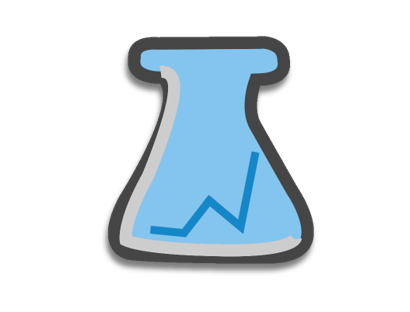

[![Contributors][contributors-shield]][contributors-url]
[![Forks][forks-shield]][forks-url]
[![Stargazers][stars-shield]][stars-url]
[![Issues][issues-shield]][issues-url]
[![GPL License][license-shield]][license-url]


<!-- PROJECT LOGO -->
<br />
<p align="center">
  <a href="https://github.com/CSC450-Project-1/rpids">
    
  </a>

  <h3 align="center">RPIDS</h3>

  <p align="center">
    GUI-based software to analyze chemical sensor array data with PCA and HCA 
    <br />
    <a href="https://github.com/CSC450-Project-1/rpids"><strong>Explore the docs »</strong></a>
    <br />
    <br />
    <a href="https://github.com/CSC450-Project-1/rpids">View Demo</a>
    ·
    <a href="https://github.com/CSC450-Project-1/rpids/issues">Report Bug</a>
    ·
    <a href="https://github.com/CSC450-Project-1/rpids/issues">Request Feature</a>
  </p>
</p>


<!-- TABLE OF CONTENTS -->
<details open="open">
  <summary><h2 style="display: inline-block">Table of Contents</h2></summary>
  <ol>
    <li>
      <a href="#about-the-project">About The Project</a>
      <ul>
        <li><a href="#background">Background</a></li>
        <li><a href="#what-is-rpids?">What is RPIDS?</a></li>
        <li><a href="#built-with">Built With</a></li>
      </ul>
    </li>
    <li>
      <a href="#getting-started">Getting Started</a>
      <ul>
        <li><a href="#prerequisites">Prerequisites</a></li>
        <li><a href="#installation">Installation</a></li>
      </ul>
    </li>
    <li><a href="#usage">Usage</a></li>
    <li><a href="#roadmap">Roadmap</a></li>
    <li><a href="#contributing">Contributing</a></li>
    <li><a href="#license">License</a></li>
    <li><a href="#contact">Contact</a></li>
    <li><a href="#acknowledgements">Acknowledgements</a></li>
  </ol>
</details>


<!-- ABOUT THE PROJECT -->
## About The Project

[![Product Name Screen Shot][product-screenshot]](https://example.com)

### Background
Chemical sensor arrays are devices with the capability to detect a broad spectrum of chemicals on a single platform. The chemical sensor arrays, sometimes called “electronic tongues”, detect components that shows different response patterns to various chemicals. Dr. Yoshimatsu and his students at Missouri State University (MSU) have developed colorimetric sensing arrays for the detection of metal ions in drinking water and proteins in food or clinical samples.  

### What is RPIDS?
RPIDS is a student-developed software that streamlines the process of data analysis for the ‘response pattern’-based identification of metal ion and proteins. RPIDS is a GUI-based software system that uses two statistical methods: principal component analysis (PCA) and hierarchical clustering analysis (HCA). RPIDS pre-processes input data, performs the statistical analysis, and displays plots of the processed data. The generated plots will greatly enhance the interpretation of the complex raw data generated by the chemical sensor arrays.


### Built With

* [Electron](https://www.electronjs.org) (JavaScript)
* [Plotly Dash](https://plotly.com/dash) (Python 3.8)


<!-- GETTING STARTED -->
## Getting Started

To get a local copy up and running follow these simple steps.

### Prerequisites

To get RPIDS to compile, you will need the necessary Node and Python dependencies installed. Before attempting to install these, please make sure you have the latest Node.js and Python 3.8 installed on your local machine.

Once you have ensured that you have Node.js installed, please navigate to the project's home directory (rpids). Please run the following command to install the necessary dependencies.

  ```sh
  npm install
  ```
To install the necessary Python dependencies, please run the following command in the home directory. NOTE: It is suggested to use a virtual Python environment when installing these dependencies, which can be achieved using [Anaconda](https://www.anaconda.com), a Python distribution tool.

  ```sh
  pip install -r requirements.txt 
  ```


### Packaging

You will need the Python library Pyinstaller installed before proceeding forward. Run the following commands to create executables of the Python files.
1. Create the Dash Server executable. NOTE: The dash_server.spec has user-specific paths to necessary Python libraries that need to be altered before running this command.
   ```sh
   pyinstaller --clean .\engine\dash_server.spec --distpath .\engine\executables
   ```
2. Create the Import Data Executable
   ```sh
   pyinstaller --clean --win-private-assemblies -F .\engine\import_data.py --distpath .\engine\executables
   ```
3. Create the Export Data Executable
   ```sh
   pyinstaller --clean --win-private-assemblies -F .\engine\export_data.py --distpath .\engine\executables
   ```
4. Delete the Unnecessary Directories Created in the Build Directory

5. Package App Into a Single Windows Executable
   ```sh
   npm run pack
   ```

<!-- USAGE EXAMPLES -->
## Usage

Use this space to show useful examples of how a project can be used. Additional screenshots, code examples and demos work well in this space. You may also link to more resources.

_For more examples, please refer to the [Documentation](https://example.com)_


<!-- ROADMAP -->
## Roadmap

See the [open issues](https://github.com/CSC450-Project-1/rpids/issues) for a list of proposed features (and known issues).


<!-- CONTRIBUTING -->
## Contributing

Contributions are what make the open source community such an amazing place to be learn, inspire, and create. Any contributions you make are **greatly appreciated**.

1. Fork the Project
2. Create your Feature Branch (`git checkout -b feature/AmazingFeature`)
3. Commit your Changes (`git commit -m 'Add some AmazingFeature'`)
4. Push to the Branch (`git push origin feature/AmazingFeature`)
5. Open a Pull Request


<!-- LICENSE -->
## License

Distributed under the GPL License. See `LICENSE` for more information.


<!-- CONTACT -->
## Contact

Project Link: [https://github.com/CSC450-Project-1/rpids](https://github.com/CSC450-Project-1/rpids)


<!-- ACKNOWLEDGEMENTS -->
## Acknowledgements

* []()
* []()
* []()


<!-- MARKDOWN LINKS & IMAGES -->
<!-- https://www.markdownguide.org/basic-syntax/#reference-style-links -->
[contributors-shield]: https://img.shields.io/github/contributors/CSC450-Project-1/repo.svg?style=for-the-badge
[contributors-url]: https://github.com/CSC450-Project-1/repo/graphs/contributors
[forks-shield]: https://img.shields.io/github/forks/CSC450-Project-1/repo.svg?style=for-the-badge
[forks-url]: https://github.com/CSC450-Project-1/repo/network/members
[stars-shield]: https://img.shields.io/github/stars/CSC450-Project-1/repo.svg?style=for-the-badge
[stars-url]: https://github.com/CSC450-Project-1/repo/stargazers
[issues-shield]: https://img.shields.io/github/issues/CSC450-Project-1/repo.svg?style=for-the-badge
[issues-url]: https://github.com/CSC450-Project-1/repo/issues
[license-shield]: https://img.shields.io/github/license/CSC450-Project-1/repo.svg?style=for-the-badge
[license-url]: https://github.com/CSC450-Project-1/repo/blob/main/LICENSE.txt
[linkedin-shield]: https://img.shields.io/badge/-LinkedIn-black.svg?style=for-the-badge&logo=linkedin&colorB=555
[linkedin-url]: https://linkedin.com/in/CSC450-Project-1
